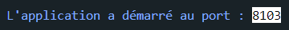
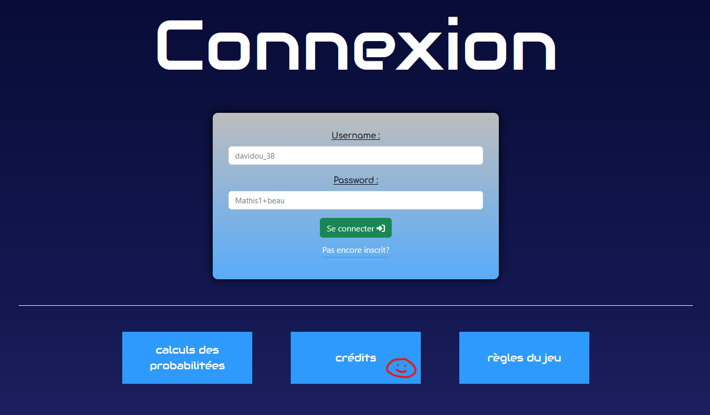
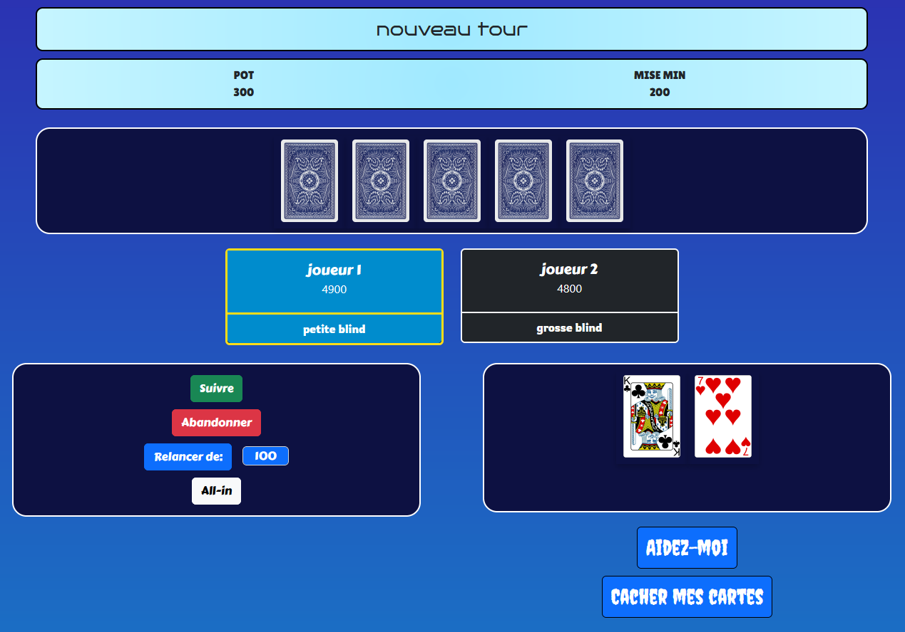

<!-- PROJECT INFO -->
<br/>
<div align="center">
  <a href="https://github.com/14personne14/poker_projet_nsi">
    
  </a>

  <h2 align="center">
    🔵 <b>Pok'help</b> 🔵
  </h2>

  <p align="center">
    Un jeu de poker fun, pour tous (mais surtout les français) et disponible en ligne.
  </p>
</div>

---

<!-- USAGE -->

## 💻 <ins>**Informations**</ins>

Vous pouvez jouer au jeu sur le site [poker.azerty.tk](https://poker.azerty.tk).

<br/>

Sinon, voici comment **démarrer le site sur son ordinateur personnel** (avec une connexion internet obligatoire) :

1.  Installez [NodeJS](https://nodejs.org/en/download) sur votre ordinateur.
2.  Ouvrir un terminal copier le code ci-dessous (cela peut prendre du temps à s'éxécuter)

    ```console
    npm install
    ```

3.  Lancer ensuite le jeu avec la commande : `npm run local`
    <br>
    Si la ligne ci-dessous apparait, cela signifie que le jeu est s'est bien lancé.
    <br>
    

4.  Aller sur ce lien pour y voir le site : [localhost:8103](http://localhost:8103/). <br>
    Si le lien ne fonctionne pas vérifier le nom du port affiché dans la console de votre terminal.

<br/>

**Comment jouer au jeu :**

1.  Créer un comte en respectant bien les consignes indiquées

2.  Se connecter dans la page de connexion

3.  Indiquer le montant voulu pour entrer en jeu

4.  Commencer la partie une fois 2 joueurs connectés au minimum (vous pouvez ajouter un second joueur en utilisant un <ins>autre navigateur web</ins> et en créant un <ins>autre compte</ins>)

<br/>

Si jamais vous rencontrer un problème avec le jeu, essayer de relancer la commande `npm run local` pour réinitialiser les problèmes. 

---

<!-- SCREENSHOT -->

## 📲 <ins>**Screenshot**</ins>

Page de connexion :


<br/>

Example du jeu :


---

<!-- BUILT WHIT -->

## 🔧 <ins>**Créé avec :**</ins>

[![Bootstrap][Bootstrap]][Bootstrap-url]

[![NodeJS][Nodejs]][Nodejs-url]

[![HTML][Html]][Html-url]

[![Css][Css]][Css-url]

[![Javascript][Javascript]][Javascript-url]

[![Sqlite][Sqlite]][Sqlite-url]

*(et d'autre petite chose pour aller plus vite...)*

---

<!-- AUTHOR -->

## 🙇 <ins>**Auteur**</ins>

#### @personne14 

-   <ins>Discord:</ins> `personne14#7817`
-   <ins>Website:</ins> [azerty.tk][Website-url]
-   <ins>Github:</ins> [@14personne14][Github-url]

<br/>

#### @kohibachiden

-   <ins>Discord:</ins> `kohibachiden#9256`
-   <ins>Github:</ins> [@kohibachiden][Github-url-2]

---

<!-- LICENCE -->

## ➤ <ins>**License**</ins>

Distributed under the <ins>_MIT License_</ins>. See [LICENSE][Licence-url] for more information.

<!-- MARKDOWN LINKS & IMAGES -->
<!-- https://shields.io/ -->

[Website-url]: https://azerty.tk/
[Github-url]: https://github.com/14personne14
[Github-url-2]: https://github.com/kohibachiden
[Licence-url]: https://en.wikipedia.org/wiki/MIT_License
[screenshot]: public/screenshot/connexion_example.png
[Python]: https://img.shields.io/badge/python-346E9E?style=for-the-badge&logo=python&logoColor=white
[Python-url]: https://python.org/
[Php]: https://img.shields.io/badge/PHP-20232A?style=for-the-badge&logo=php&logoColor=white
[Php-url]: https://php.net/
[Bootstrap]: https://img.shields.io/badge/Bootstrap-563D7C?style=for-the-badge&logo=bootstrap&logoColor=white
[Bootstrap-url]: https://getbootstrap.com/
[JQuery]: https://img.shields.io/badge/jQuery-0769AD?style=for-the-badge&logo=jquery&logoColor=white
[JQuery-url]: https://jquery.com/
[Nodejs]: https://img.shields.io/badge/Node.JS-499537?style=for-the-badge&logo=node.js&logoColor=white
[Nodejs-url]: https://nodejs.org/
[Html]: https://img.shields.io/badge/html-DD4B25?style=for-the-badge&logo=html5&logoColor=white
[Html-url]: https://developer.mozilla.org/fr/docs/Web/HTML
[Javascript]: https://img.shields.io/badge/Javascript-EFD81D?style=for-the-badge&logo=javascript&logoColor=black&textColor=black
[Javascript-url]: https://developer.mozilla.org/fr/docs/Web/JavaScript
[Discordpy]: https://img.shields.io/badge/Discord.py-2D2D2D?style=for-the-badge&logo=discord&logoColor=white
[Discordpy-url]: https://discordpy.readthedocs.io/en/stable/
[Sqlite]: https://img.shields.io/badge/Sqlite-0F7BC8?style=for-the-badge&logo=sqlite&logoColor=white
[Sqlite-url]: https://sqlite.org/
[Css]: https://img.shields.io/badge/Css-214CE5?style=for-the-badge&logo=css3&logoColor=white
[Css-url]: https://developer.mozilla.org/fr/docs/Web/CSS
